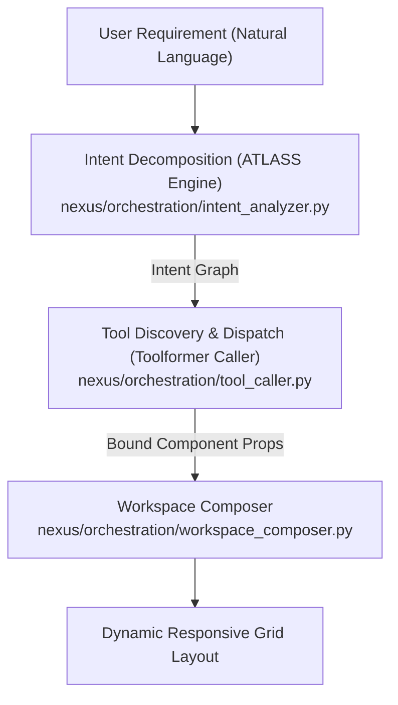

# Nexus: Self-Configuring Multi-Agent Productivity Platform

[](https://www.python.org/)
[](LICENSE)

Nexus is an agentic platform designed to synthesize dynamic, task-tailored desktop workspaces from natural language requirements. Rather than unreliably generating monolithic code from scratch, Nexus decomposes user intents and orchestrates modular React components from a curated capability catalog.

---

## Architecture Overview



### Core Orchestration Pipeline (`nexus/orchestration/`)
- **Intent Analyzer (`intent_analyzer.py`):** Parses user requirements into atomic sub-intents with domain routing (`student`, `shopkeeper`, `mixed`).
- **Tool Caller (`tool_caller.py`):** Selects appropriate UI components and binds properties against TypeScript component interfaces.
- **Workspace Composer (`workspace_composer.py`):** Dynamically computes CSS grid placement and responsive layout constraints.
- **Agentic Loop (`agentic_loop.py`):** Coordinates multi-turn execution and state verification.

---

## Component Catalog (`registry/`)

### Student Domain (`registry/student/`)
- `PomodoroTimer.tsx` — Focus & interval timer with session callbacks
- `GradeTracker.tsx` — GPA and course credit calculator
- `FlashcardDeck.tsx` — Spaced repetition flashcards with rating metrics
- `AssignmentTracker.tsx` — Course milestone and deadline manager
- `NotesEditor.tsx` — Markdown note-taking workspace
- `FormulaSheet.tsx` — Searchable LaTeX mathematical reference
- `CitationGenerator.tsx` — APA/IEEE academic reference generator
- `AttendanceTracker.tsx` — Minimum threshold and absent day calculator

### Shopkeeper Domain (`registry/shopkeeper/`)
- `DailyCashLedger.tsx` — Opening/closing cash balance tracking
- `InventoryStockTable.tsx` — Warehouse SKU counts & low stock alerts
- `SupplierContactList.tsx` — Wholesale vendor directory & payables
- `BarcodeScannerInput.tsx` — POS checkout barcode reader
- `ProfitMarginCalculator.tsx` — Cost/selling price margin optimization
- `ExpiryDateAlerts.tsx` — Perishable inventory shelf-life tracker
- `DailySalesReceipt.tsx` — Tax invoice printer & itemized bill
- `CustomerUdharKhata.tsx` — Store credit / customer ledger tracker

---

## Getting Started

### Installation
```bash
pip install -r requirements.txt
```

### Environment Setup
```bash
# Configure your LLM API Key
export GEMINI_API_KEY="your_api_key_here"
```
